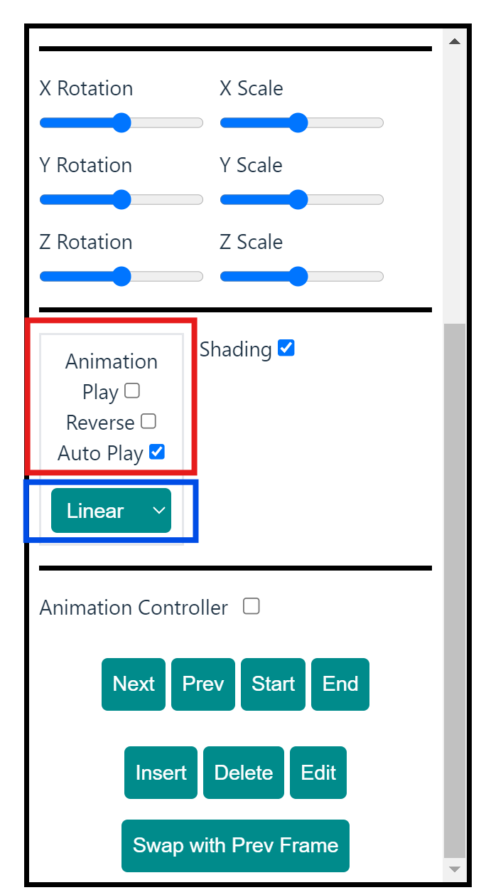
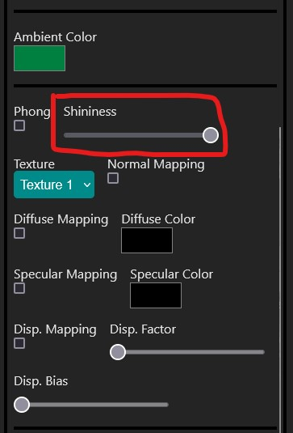

## Panduan

### Panduan Instalasi + Setup

1. Lakukan clone pada repository ini.
2. Jalankan `npm install` pada _root_ project ini.
3. Jalankan `npm run dev` dan tunggu hingga _dev server_ dijalankan pada _url default_ `http://localhost:5173/`.
4. Buka `http://localhost:5173` pada browser.

### Panduan Penggunaan

1. Model default yang ditampilkan adalah `tower.json` yang juga terdapat pada folder `test` di project ini. Jika ingin mengganti model, klik button `Load` pada menu bagian kiri di section 1 (lihat gambar).

2. Tipe kamera yang digunakan untuk melihat objek pada canvas dapat diubah melalui selector pada menu bagian kiri di section 1 (lihat gambar).

3. Project ini mengimplementasikan _orbit controls_. Cara pengunaannya adalah dengan meng-klik pada area canvas, kemudian ditahan dan didrag untuk dapat mengitari objek sesuai dengan tipe kamera yang sedang digunakan. Lakukan mouse wheel up/down untuk meng-_adjust_ jarak kamera.
4. Jarak kamera juga dapat diatur melalui _input range_ dan tampilan juga dapat di-reset dengan menekan tombol `Reset View`. Keduanya ini berada pada menu bagian kiri di section 1 (lihat gambar).

5. Untuk melakukan transformasi pada objek yang berada di dalam canvas, dapat dengan menggunakan _input range_ yang tersedia pada menu bagian kiri di section 2 dan 3 (lihat gambar). Defaultnya semua bagian objek akan ter-_select_ sehingga transformasi yang dilakukan akan dikenakan pada semua bagian objek.

6. Untuk dapat melakukan transformasi pada bagian-bagian tertentu objek, dapat melakukan klik pada bagian objek yang ingin ditransformasi, pada `Scene Graph` yang terletak pada menu bagian tengah dengan (lihat gambar). Setelah melakukan klik/seleksi bagian tersebut, transformasi dapat dilakukan dengan cara yang sama pada _step_ 5.

7. Untuk dapat menyalakan animasi, centang pilihan `Play` yang ada pada menu bagian kiri di section 4 (lihat gambar di dalam kotak merah). `Auto Play` akan tercentang secara default sehingga animasi akan di-_play_ secara _loop_. Untuk melakukan reverse animasi, centang pilihan `Reverse` pada tempat yang sama. Animasi selalu dilakukan pada seluruh bagian objek sebagai 1 kesatuan.
   _Animation tweening_ secara default adalah bernilai `Linear`, dan dapat diubah dengan mengklik dan memilih value yang ingin dicoba (lihat gambar di dalam kotak biru).

8. Fitur _animation controller_ dapat diaktifkan dengan cara centang pilihan `Animation Controller` pada menu bagian kiri di section 5 (lihat gambar). Setelah menyalakan fitur tersebut, animasi akan distop jika sedang dalam kondisi _play_. Transformasi pada objek tetap dapat dilakukan saat `Animation Controller` sedang diaktifkan. Modifikasi animasi dapat dilakukan dan akan muncul keterangan `Frame Index` untuk menunjukan urutan frame keberapa animasi sekarang. Beberapa modifikasi animasi yang dapat dilakukan pada objek yang sedang ditampilkan pada kanvas:

- Tombol `Next` untuk menuju frame animasi setelah `Frame Index`.
- Tombol `Prev` untuk menuju frame animasi sebelum `Frame Index`.
- Tombol `Start` untuk menuju frame animasi dengan `Frame Index` ke-0.
- Tombol `End` untuk menuju frame animasi dengan `Frame Index` terakhir dari animasi.
- Tombol `Insert` untuk melakukan insert data objek sekarang (berupa transformasi) sebagai frame baru ke dalam animasi dengan urutan ke `Frame Index` sekarang.
- Tombol `Delete` untuk menghapus frame animasi urutan `Frame Index` sekarang.
- Tombol `Edit` untuk mengupdate frame animasi urutan `Frame Index` sekarang. Setelah menekan tombol `Edit` (akan berubah menjadi `Save`), anda dapat melakukan transformasi dan jika sudah, anda dapat menekan tombol `Save` pada tombol yang sama.
- Tombol `Swap with Prev Frame` untuk melakukan swapping frame animasi urutan `Frame Index` sekarang dengan `Frame Index` sebelumnya. NOTE: swap tidak dapat dilakukan jika `Frame Index` sekarang adalah 0.

NOTE: Semua animasi hanya berlaku pada _articulated model_

9. Untuk mengubah ambient color pada object, tekan bagian color picker yang berjudul `Ambient Color` dan warna ambient akan terubah pada object dalam canvas.

10. Object pada canvas dapat memiliki sebuah material; basic ataupun phong. Untuk mengaktifkan phong material pada object, tekan checkbox dengan judul `Phong`. Jika checkbox tersebut tecentang, atribut lainnya seperti shininess, diffuse, specular, dan juga displacement dapat diubah.

11. Shininess dapat diatur menggunakan slider yang sudah ada dengan nilai antara 1 hingga 128.

13. Terdapat 3 buah texture yang dapat dipilih untuk setiap object, texture ini dapat diatur dari dropdown `Texture` yang sudah tersedia.

15. Untuk semua jenis mapping (normal, diffuse, specular, dan displacement), dapat diaktifkan/non-aktifkan melalui checkbox. Untuk diffuse dan specular, warnanya dapat dipilih menggunakan color picker pada tampilan jika mapping telah diaktifkan. Untuk displacement, nilai factor dan biasnya dapat di-set melalui slider yang tersedia  apabila mapping telah diaktifkan.

## Pembagian Tugas

| NIM      | Hollow Model | Object Model | Pembagian Kerja |
| -------- | ------------ | ------------ | --------------- |
| 13521075 | x            | x            | x               |
| 13521087 | Triangular-prism            | Gerobak            | x               |
| 13521097 | Penta-prism            | Eskrim            | x               |
| 13521102 | Box          | Tower        | x               |
